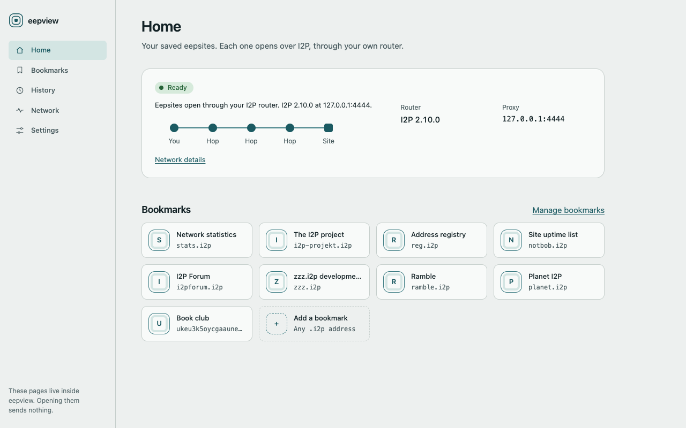
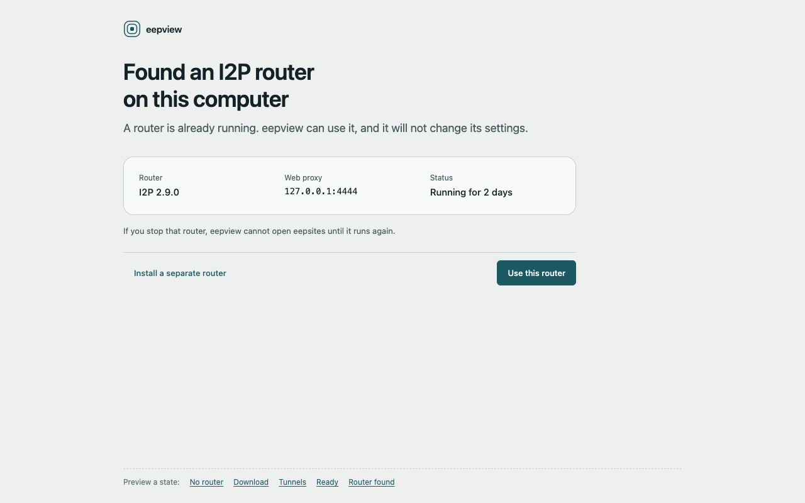
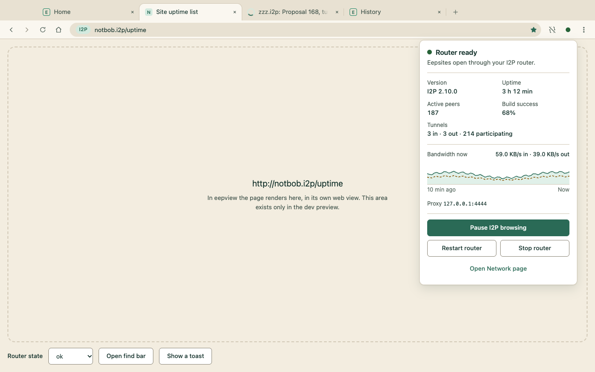

  <picture>
    <source media="(prefers-color-scheme: dark)" srcset="assets/brand/eepview-logo-horizontal-dark.svg">
    
  </picture>

<strong>Browse the I2P network. Nothing else, nothing leaks.</strong>

  
  
  

## What is eepview?

I2P is a private network with its own sites, which end in `.i2p`. To reach them you need a router, and the setup is not easy. A normal browser can also leak your real IP address if one setting is wrong. eepview is a small browser made for I2P and nothing else. It finds or installs a router for you, and its pages cannot reach the normal internet.

## Why eepview

- **Plug and play.** eepview finds a router or installs one for you. It asks before every network action.
- **I2P only.** Pages cannot reach the normal internet. This is by design, not a setting you can get wrong.
- **Private by default.** Cookies are cleared when you quit. WebRTC is off.
- **Familiar.** Tabs, bookmarks, history and find in page work the way you expect.
- **Light.** It uses the web engine already on your system, so the download is small.

Some of these are not in a release yet. They arrive with v0.1.

## Screenshots

  <picture>
    <source media="(prefers-color-scheme: dark)" srcset="docs/images/ui/home-dark.png">
    
  </picture>
   <em>The home page.</em>

  <picture>
    <source media="(prefers-color-scheme: dark)" srcset="docs/images/ui/setup-found-dark.png">
    
  </picture>
   <em>First start: eepview looks for a router and asks before it does anything.</em>

  <picture>
    <source media="(prefers-color-scheme: dark)" srcset="docs/images/ui/router-panel-dark.png">
    
  </picture>
   <em>The router panel shows the state of your connection.</em>

## Get started

1. Download eepview from [GitHub Releases](https://github.com/tcivie/eepview/releases). The first release, v0.1, is coming.
2. Start it. eepview looks for an I2P router on your computer.
3. If it finds none, it offers to install one. Nothing happens until you say yes. When the router is ready, open a `.i2p` site.

The [wiki](https://github.com/tcivie/eepview/wiki) has the full install steps.

## Learn more

- [User guide](https://github.com/tcivie/eepview/wiki): install, first run, using eepview, privacy and security, troubleshooting and FAQ.
- [Developer guide](https://github.com/tcivie/eepview/wiki): build from source and how the code fits together.
- [Contributing](https://github.com/tcivie/eepview/blob/main/CONTRIBUTING.md)
- [Security policy](https://github.com/tcivie/eepview/blob/main/SECURITY.md)

## Not affiliated

eepview is an independent project and is not affiliated with the I2P project.

## License

[MIT](LICENSE)
